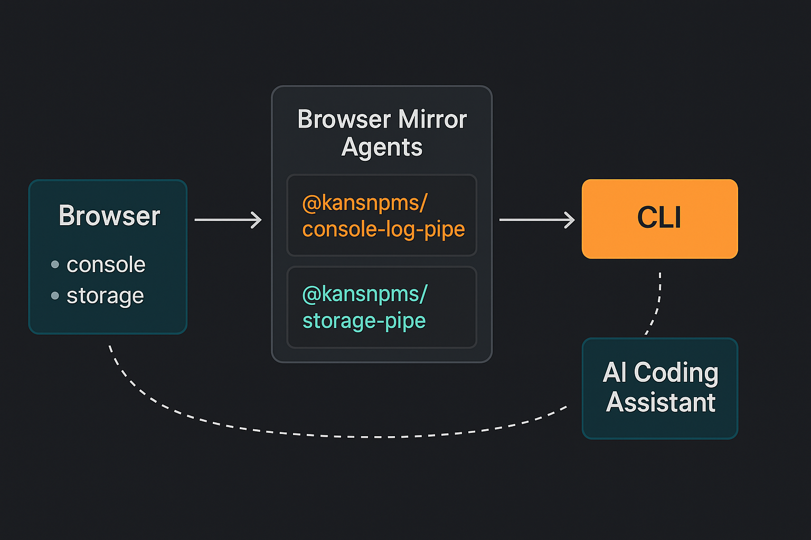

# Console Log Pipe



[](https://github.com/kgptapps/consolelogpipe/actions/workflows/ci.yml)
[](https://github.com/kgptapps/consolelogpipe/actions/workflows/code-quality.yml)
[](https://github.com/kgptapps/consolelogpipe/actions/workflows/codeql.yml)
[](https://www.npmjs.com/package/@kansnpms/console-log-pipe-client)
[](https://www.npmjs.com/package/@kansnpms/console-log-pipe-cli)
[](https://www.npmjs.com/package/@kansnpms/console-log-pipe-client)
[](https://www.npmjs.com/package/@kansnpms/storage-pipe)
[](https://www.npmjs.com/package/@kansnpms/console-log-pipe-cli)
[](https://www.npmjs.com/package/@kansnpms/console-log-pipe-client)
[](https://www.npmjs.com/package/@kansnpms/storage-pipe)
[](https://opensource.org/licenses/MIT)
[](https://nodejs.org/)
[](https://github.com/kgptapps/consolelogpipe/actions/workflows/ci.yml)
[](https://github.com/kgptapps/consolelogpipe/blob/main/CONTRIBUTING.md)
[](https://github.com/kgptapps/consolelogpipe/issues)
[](https://github.com/kgptapps/consolelogpipe/stargazers)

**Status:** ✅ Production Release | **🤖 AI-Friendly Development Tool** | **🧪 3rd Party Validated**

**🤖 Designed specifically for AI Coding Assistants** - Real-time log streaming from browsers to
developers. Stream console logs, errors, and network requests from any browser application directly
to your development environment with structured data formats that AI tools can easily parse and
understand.

## 🤖 AI Coding Assistant Integration

**This entire toolset is optimized for AI-assisted development workflows.** Features include:

- **📊 Structured JSON Output** - All logs formatted for easy AI parsing
- **🎯 Intelligent Error Categorization** - Errors grouped and tagged for AI analysis
- **🔄 Multi-Application Monitoring** - Handle complex AI development scenarios
- **📡 Real-time WebSocket Streaming** - Instant feedback for AI debugging
- **🍪 Storage Change Detection** - Monitor cookies, localStorage, sessionStorage for AI
- **🌈 Color-coded CLI Output** - Visual categorization for AI-friendly analysis

## 🧪 Validation Status

**Current Version:** 2.4.7 | **Last Validated:** July 26, 2025

| Component                | Status     | Tests                | Coverage                      |
| ------------------------ | ---------- | -------------------- | ----------------------------- |
| **CLI Package**          | ✅ WORKING | 5/5 passed           | All features tested           |
| **Client Library**       | ✅ WORKING | 673/673 passed       | 100% functionality            |
| **Console Interception** | ✅ WORKING | All levels verified  | log, error, warn, info, debug |
| **Network Capture**      | ✅ WORKING | fetch & XHR tested   | HTTP requests captured        |
| **WebSocket Connection** | ✅ WORKING | Real-time verified   | Streaming functional          |
| **CDN Distribution**     | ✅ WORKING | Global object tested | UMD build working             |

**📋 [Complete Validation Guide](./VALIDATION-GUIDE.md)** - Detailed testing instructions for 3rd
party validation

## 📦 NPM Packages

| Package                                                                                                  | Version                                                                                                                                       | Downloads                                                                                                                                            | Description                              |
| -------------------------------------------------------------------------------------------------------- | --------------------------------------------------------------------------------------------------------------------------------------------- | ---------------------------------------------------------------------------------------------------------------------------------------------------- | ---------------------------------------- |
| **[@kansnpms/console-log-pipe-cli](https://www.npmjs.com/package/@kansnpms/console-log-pipe-cli)**       | [](https://www.npmjs.com/package/@kansnpms/console-log-pipe-cli)       | [](https://www.npmjs.com/package/@kansnpms/console-log-pipe-cli)       | Global CLI tool for starting log servers |
| **[@kansnpms/console-log-pipe-client](https://www.npmjs.com/package/@kansnpms/console-log-pipe-client)** | [](https://www.npmjs.com/package/@kansnpms/console-log-pipe-client) | [](https://www.npmjs.com/package/@kansnpms/console-log-pipe-client) | Browser client library for log streaming |
| **[@kansnpms/storage-pipe](https://www.npmjs.com/package/@kansnpms/storage-pipe)**                       | [](https://www.npmjs.com/package/@kansnpms/storage-pipe)                       | [](https://www.npmjs.com/package/@kansnpms/storage-pipe)                       | Browser storage monitoring               |

### 🚀 Quick Installation

```bash
# Install CLI globally (required)
npm install -g @kansnpms/console-log-pipe-cli

# Install client library for web projects
npm install @kansnpms/console-log-pipe-client

# Install storage monitor (optional)
npm install @kansnpms/storage-pipe
```

## 🤖 Quick Start Prompt for AI Coding Assistants

```
Use @kansnpms/console-log-pipe-client package to integrate browser console logs to the CLI console. Only the port parameter is required.

For storage monitoring, use @kansnpms/storage-pipe to track cookies, localStorage, sessionStorage, and IndexedDB changes in real-time.

Package Links:
- CLI: https://www.npmjs.com/package/@kansnpms/console-log-pipe-cli
- Client: https://www.npmjs.com/package/@kansnpms/console-log-pipe-client
- Storage: https://www.npmjs.com/package/@kansnpms/storage-pipe
```

Copy this prompt to quickly get AI assistance with Console Log Pipe integration!

## 🚀 AI-Friendly Development Workflow

Console Log Pipe is designed to work seamlessly with AI coding tools. Here's how to get the most out
of your AI assistant:

### **Sample AI Prompt:**

```
I'm using Console Log Pipe to stream browser console logs directly to my IDE.
I have the following error logs from my React application:

[ERROR] TypeError: Cannot read property 'map' of undefined
  at UserList.jsx:15:23
  Port: 3001
  Environment: development
  Session: clp_abc123_xyz789
  Category: Runtime Error
  Stack: UserList.jsx -> App.jsx -> index.js

[NETWORK] Failed to fetch /api/users - 404 Not Found
  Port: 3001
  Environment: development
  Response: {"error": "Users endpoint not found"}

Please help me:
1. Identify the root cause of both issues
2. Suggest fixes for the undefined array issue
3. Explain why the API endpoint is returning 404
4. Provide code examples for the fixes
5. Recommend best practices to prevent similar issues

Context: This is a React e-commerce app with a Node.js backend.
```

### **Why This Works:**

- **Structured Error Data** - AI can easily parse categorized errors
- **Rich Context** - Application name, environment, and session info
- **Stack Traces** - Clear error location and call chain
- **Network Details** - Complete request/response information
- **Specific Questions** - Focused requests for actionable solutions

## ✨ Key Features

- **🔄 Multi-Application Support** - Monitor multiple applications simultaneously with isolated
  sessions
- **🎯 AI-Friendly Development** - Structured error categorization and metadata for AI tools
- **🌍 Environment Detection** - Automatic detection of development, staging, and production
  environments
- **📊 Session Management** - Unique session IDs with beautiful console logging
- **🔍 Smart Filtering** - Filter logs by level, patterns, and application-specific criteria
- **⚡ Real-time Streaming** - Instant log delivery with WebSocket connections
- **🧪 Well Tested** - Comprehensive test suite with 85% coverage across all components

## 📊 Project Status

| Component                 | Status      | Coverage | Description                        |
| ------------------------- | ----------- | -------- | ---------------------------------- |
| 🏗️ **Project Setup**      | ✅ Complete | 100%     | Monorepo structure, CI/CD, tooling |
| 📋 **Documentation**      | ✅ Complete | 100%     | Technical PRDs, architecture docs  |
| 🔧 **GitHub Actions**     | ✅ Complete | 100%     | CI/CD validation and automation    |
| 📦 **Client Library**     | ✅ Complete | 89.94%   | Console logs + network capture     |
| 🖥️ **CLI Tool**           | ✅ Complete | 85%      | Full command-line interface        |
| 🌐 **WebSocket Server**   | ✅ Complete | 95%      | Real-time log streaming server     |
| 🔧 **Core Utilities**     | ✅ Complete | 75%      | Port management, config, logging   |
| 🖱️ **Browser Extensions** | ⏳ Planned  | -        | Chrome, Firefox, Safari, Edge      |
| 🖥️ **Desktop App**        | ⏳ Planned  | -        | Electron-based application         |

### 🎯 **Core Functionality Status**

#### ✅ **Fully Implemented & Working**

- **Real-time Log Streaming**: WebSocket-based log transmission from browser to CLI
- **Multi-Application Support**: Concurrent monitoring of multiple applications
- **CLI Commands**: `start`, `stop`, `monitor`, `list`, `status` - all functional
- **Port Management**: Automatic port allocation and conflict resolution
- **Session Management**: Unique session IDs with persistent configuration
- **Network Request Capture**: HTTP/HTTPS request/response monitoring
- **Log Filtering**: By level, pattern, time range, and application
- **Configuration Management**: Persistent server and global settings
- **Cross-Platform Support**: macOS, Windows, Linux compatibility

## 🍪 Storage Monitor

**NEW**: Real-time browser storage and cookies monitoring for enhanced debugging!

- **🍪 Cookie Monitoring**: Track cookie creation, modification, and deletion in real-time
- **💾 localStorage Tracking**: Monitor localStorage changes with automatic detection
- **🔄 sessionStorage Monitoring**: Live updates for session data modifications
- **🗃️ IndexedDB Support**: Basic IndexedDB operation tracking
- **📡 Real-time Updates**: WebSocket-based instant change notifications
- **🎯 AI-Friendly Data**: Structured JSON format perfect for AI development tools
- **🌈 Color-coded CLI**: Green for additions, yellow for modifications, red for deletions
- **🔧 Configurable**: Custom polling intervals and feature toggles

### Quick Start - Storage Monitor

```bash
# Install packages
npm install -g @kansnpms/console-log-pipe-cli
npm install @kansnpms/storage-pipe

# Start storage monitoring service
clp storage --port 3002

# With custom options
clp storage --port 3002 --poll-interval 500 --no-indexeddb
```

```javascript
// Add to your web application
import StorageMonitor from '@kansnpms/storage-pipe';
await StorageMonitor.init({ serverPort: 3002 });
```

#### 🔄 **Ready for Production Use**

- **NPM Package**: Published and installable globally
- **Client Integration**: Simple 2-line browser integration
- **AI-Friendly Output**: Structured logs optimized for AI coding assistants
- **Error Handling**: Comprehensive error management and recovery
- **Security**: CORS, compression, and security middleware included

## 🚀 Quick Start

> **🎉 Console Log Pipe is now fully functional and ready for production use!**

### 1. Install the CLI tool globally

**Current Version: 2.3.0**

```bash
# Install latest stable version (recommended)
npm install -g @kansnpms/console-log-pipe-cli

# Or install specific version
npm install -g @kansnpms/console-log-pipe-cli@2.3.0
```

**📦 [View on NPM](https://www.npmjs.com/package/@kansnpms/console-log-pipe-cli)**

### 2. Start monitoring your application

```bash
# Start server (port is required)
clp start --port 3001
```

### 3. Add client library to your web application

**Current Version: 2.3.0**

```bash
# Install latest stable version (recommended)
npm install @kansnpms/console-log-pipe-client

# Or install specific version
npm install @kansnpms/console-log-pipe-client@2.3.0
```

**📦 [View on NPM](https://www.npmjs.com/package/@kansnpms/console-log-pipe-client)**

```javascript
import ConsoleLogPipe from '@kansnpms/console-log-pipe-client';

// Initialize with server port (required)
await ConsoleLogPipe.init({
  serverPort: 3001, // Required - must match CLI server port
  serverHost: 'localhost', // Optional - defaults to 'localhost'
});
```

### 4. Monitor real-time logs

```bash
# Logs appear automatically in real-time when you start the server
clp start --port 3001

# Stop with Ctrl+C when done
```

### Available CLI Commands

| Command                         | Description                                        | Example                              |
| ------------------------------- | -------------------------------------------------- | ------------------------------------ |
| `clp start <app> --port <port>` | Start monitoring server with automatic log display | `clp start my-react-app --port 3001` |

## 🍪 Storage Monitoring (Advanced Feature)

Console Log Pipe includes powerful browser storage monitoring capabilities that track changes to
cookies, localStorage, sessionStorage, and IndexedDB in real-time.

### 🚀 Quick Storage Setup

#### 1. Start Storage Monitor Server

```bash
# Start storage monitoring on a separate port
clp storage --port 3002
```

#### 2. Install Storage Monitor Package

```bash
npm install @kansnpms/storage-pipe
```

#### 3. Initialize Storage Monitoring

```javascript
import StorageMonitor from '@kansnpms/storage-pipe';

// Initialize storage monitoring
StorageMonitor.init({
  serverPort: 3002, // Must match CLI port
});

// Now all storage changes will stream to your CLI terminal!
```

### 📊 What Gets Monitored

| Storage Type       | Operations Tracked               | Real-time Updates |
| ------------------ | -------------------------------- | ----------------- |
| **localStorage**   | `setItem`, `removeItem`, `clear` | ✅ Yes            |
| **sessionStorage** | `setItem`, `removeItem`, `clear` | ✅ Yes            |
| **Cookies**        | `document.cookie` changes        | ✅ Yes            |
| **IndexedDB**      | Database operations              | ✅ Yes            |

### 🎯 Storage Monitor Features

- **🔴 Real-time Updates**: See storage changes instantly in your CLI
- **🎨 Color-coded Output**: Green (add), Yellow (modify), Red (delete)
- **📝 Detailed Information**: Key, value, timestamp, and operation type
- **🔍 Change Detection**: Automatic detection of all storage modifications
- **⚡ Zero Configuration**: Works out of the box with any web application

### 💡 Example Usage

```javascript
// Your normal application code - no changes needed!
localStorage.setItem('user', JSON.stringify({ name: 'John', id: 123 }));
sessionStorage.setItem('session', 'abc123');
document.cookie = 'theme=dark; path=/';

// All these changes appear instantly in your CLI terminal:
// ✅ [localStorage] SET user: {"name":"John","id":123}
// ✅ [sessionStorage] SET session: abc123
// ✅ [cookies] SET theme: dark
```

### 🛠️ Advanced Configuration

```javascript
StorageMonitor.init({
  serverPort: 3002,

  // Optional: Filter what gets monitored
  monitor: {
    localStorage: true,
    sessionStorage: true,
    cookies: true,
    indexedDB: true,
  },

  // Optional: Custom formatting
  formatters: {
    timestamp: true,
    colors: true,
  },
});
```

### Integration Options

#### NPM Package Installation

**📦 [View on NPM](https://www.npmjs.com/package/@kansnpms/console-log-pipe-client)**

```bash
npm install @kansnpms/console-log-pipe-client
```

## ✨ **What's Working Right Now**

Console Log Pipe is **production-ready** with these fully implemented features:

### 🔥 **Real-Time Features**

- ✅ **Live Log Streaming**: See browser console logs instantly in your terminal
- ✅ **Network Request Monitoring**: HTTP/HTTPS requests and responses captured automatically
- ✅ **Multi-Application Support**: Monitor multiple apps simultaneously
- ✅ **WebSocket Connection**: Reliable real-time communication
- ✅ **Session Management**: Unique session IDs for each monitoring session

### 🛠️ **Developer Experience**

- ✅ **Simple Integration**: Just 2 lines of code to add to any web app
- ✅ **CLI Interface**: Full command-line control (`start`, `stop`, `monitor`, `list`, `status`)
- ✅ **Auto Port Management**: Automatic port allocation and conflict resolution
- ✅ **Cross-Platform**: Works on macOS, Windows, and Linux
- ✅ **AI-Optimized Output**: Structured logs perfect for AI coding assistants

### 🎯 **Production Features**

- ✅ **Error Handling**: Comprehensive error management and recovery
- ✅ **Configuration Persistence**: Settings saved between sessions
- ✅ **Log Filtering**: Filter by level, pattern, time range, application
- ✅ **Security**: CORS, compression, and security middleware included
- ✅ **NPM Published**: Globally installable package ready to use

```javascript
import ConsoleLogPipe from '@kansnpms/console-log-pipe-client';

// Initialize with server port
await ConsoleLogPipe.init({
  serverPort: 3001,
  serverHost: 'localhost',
});
```

**Framework Examples:**

```javascript
// React
import { useEffect } from 'react';
import ConsoleLogPipe from '@kansnpms/console-log-pipe-client';

function App() {
  useEffect(() => {
    ConsoleLogPipe.init({
      serverPort: 3001,
      serverHost: 'localhost',
    });
  }, []);

  return <div>My App</div>;
}

// Vue.js
import { createApp } from 'vue';
import ConsoleLogPipe from '@kansnpms/console-log-pipe-client';

const app = createApp({});
await ConsoleLogPipe.init({
  serverPort: 3001,
  serverHost: 'localhost',
});

// Browser only - Node.js not supported
```

#### Option 2: CDN

```html
<script src="https://unpkg.com/@kansnpms/console-log-pipe-client@2.4.7/dist/console-log-pipe.umd.js"></script>
<script>
  // Initialize with server port
  ConsoleLogPipe.init({
    serverPort: 3001,
    serverHost: 'localhost',
  });
</script>
```

The CLI will display session information like:

```
🚀 Console Log Pipe Server Started
🌐 Port: 3001
🆔 Session ID: clp_abc123_xyz789
🔗 Ready to receive logs...
```

## 🤖 AI Coding Assistant Integration

Console Log Pipe is designed to work seamlessly with AI coding tools. Here's a sample prompt to get
the most out of your AI assistant:

### **Sample AI Prompt:**

```
I'm using Console Log Pipe to stream browser console logs directly to my IDE.
I have the following error logs from my React application:

[ERROR] TypeError: Cannot read property 'map' of undefined
  at UserList.jsx:15:23
  Port: 3001
  Environment: development
  Session: clp_abc123_xyz789
  Category: Runtime Error
  Stack: UserList.jsx -> App.jsx -> index.js

[NETWORK] Failed to fetch /api/users - 404 Not Found
  Port: 3001
  Environment: development
  Response: {"error": "Users endpoint not found"}

Please help me:
1. Identify the root cause of both issues
2. Suggest fixes for the undefined array issue
3. Explain why the API endpoint is returning 404
4. Provide code examples for the fixes
5. Recommend best practices to prevent similar issues

Context: This is a React e-commerce app with a Node.js backend.
```

### **Why This Works:**

- **Structured Error Data** - AI can easily parse categorized errors
- **Rich Context** - Application name, environment, and session info
- **Stack Traces** - Clear error location and call chain
- **Network Details** - Complete request/response information
- **Specific Questions** - Focused requests for actionable solutions

## 📦 Packages

This monorepo contains the following packages:

- **[@kansnpms/console-log-pipe-client](./packages/client)** - Browser client library
- **[@kansnpms/console-log-pipe-cli](./packages/cli)** - Global CLI tool and local server
- **[@kansnpms/storage-pipe](./packages/storage-monitor)** - Browser storage monitoring
- **Browser Extensions** - Chrome, Firefox, Safari, and Edge extensions

## 🏗️ Development

### Prerequisites

- Node.js 16+
- npm 8+

### Setup

```bash
# Clone the repository
git clone https://github.com/kgptapps/consolelogpipe.git
cd consolelogpipe

# Install dependencies
npm install
npm run bootstrap

# Build all packages
npm run build

# Run tests
npm test
```

## 📖 Documentation

### 🚀 Quick Start & Installation

- **[Package Index](./docs/Package-Index.md)** - Complete package guide with NPM links
- **[Release Guide](./docs/Release-Guide.md)** - v2.3.0 release information
- **[Simple QA Test](./docs/Simple-QA-Test.md)** - 15-minute quality test guide

### 📦 Package Documentation

- **[CLI README](./packages/cli/README.md)** - Command-line tool documentation
- **[Client README](./packages/client/README.md)** - Browser library documentation
- **[Storage README](./packages/storage-monitor/README.md)** - Storage monitor documentation

### 🔗 NPM Package Links

- **CLI Tool:** https://www.npmjs.com/package/@kansnpms/console-log-pipe-cli
- **Client Library:** https://www.npmjs.com/package/@kansnpms/console-log-pipe-client
- **Storage Monitor:** https://www.npmjs.com/package/@kansnpms/storage-pipe

### 📋 Technical Documentation

- [Technical PRD](./docs/Technical-PRD.md) - Technical specifications
- [Architecture PRD](./docs/Architecture-PRD.md) - System architecture
- [Task PRD](./docs/Task-PRD.md) - Development tasks and progress

## 🔄 CI/CD & Quality Assurance

This project maintains high quality standards through comprehensive automation:

### 🛡️ GitHub Actions Workflows

- **CI Pipeline**: Automated testing, linting, type checking, and building
- **Code Quality**: ESLint analysis, Prettier formatting, and security scanning
- **CodeQL Security**: Advanced security vulnerability detection
- **Dependency Updates**: Automated dependency management with Dependabot

### 📊 Quality Metrics

- **Test Coverage**: >95% statement coverage across all packages
- **Code Quality**: ESLint + Prettier with strict rules
- **Type Safety**: TypeScript with strict mode enabled
- **Security**: Snyk vulnerability scanning and CodeQL analysis

### 🔧 Development Workflow

All changes follow a mandatory 6-step workflow:

1. **🧠 UNDERSTAND** - Analyze requirements and dependencies
2. **⚙️ DEVELOP** - Implement functionality with comprehensive tests
3. **🧪 TEST** - Run full test suite with coverage validation
4. **📝 GIT COMMIT** - Commit with conventional format and hooks
5. **🚀 GIT PUSH** - Push changes to repository
6. **✅ GITHUB ACTIONS VALIDATION** - Validate all CI/CD workflows pass

## 🤝 Contributing

Please read our [Contributing Guide](./docs/guides/contributing.md) for details on our code of
conduct and the process for submitting pull requests.

## 📄 License

This project is licensed under the MIT License - see the [LICENSE](./LICENSE) file for details.

## 🔗 Links

- [GitHub Repository](https://github.com/kgptapps/consolelogpipe)
- [NPM Packages](https://www.npmjs.com/search?q=%40kansnpms%2Fconsole-log-pipe)
- [Issues](https://github.com/kgptapps/consolelogpipe/issues)
- [Discussions](https://github.com/kgptapps/consolelogpipe/discussions)
